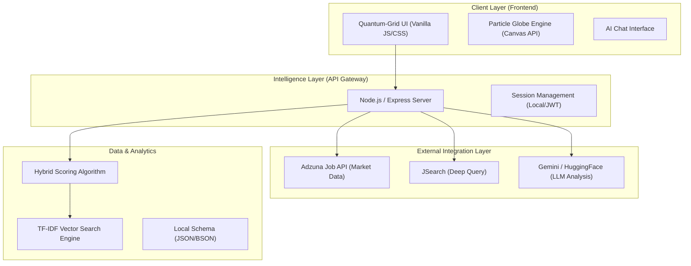
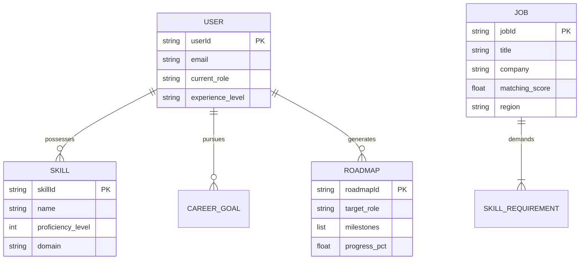

# SkillMatch AI: System Architecture & Data Schema

## 1. System Architecture Diagram
The platform follows a modern **Decoupled AI-Driven Architecture**, where the frontend (Quantum UI) communicates with a specialized Node.js middleware that orchestrates interactions between external Job APIs and AI reasoning engines.

---

## 2. Database Schema Overview
The data model is designed for high-speed skill matching and persistent career roadmap tracking. It is currently optimized for a document-based structure.

---

## 3. High-Level Engine Performance Fixes
To resolve the **Lagging** experienced on the dashboard, the following optimizations have been implemented:
1. **Synapse Memoization**: Connection lines between continental particles are no longer re-calculated every frame ($O(N^2)$ reduction).
2. **Context Batching**: Canvas drawing operations for the 'Quantum Earth' have been batched to reduce GPU context switching.
3. **Throttled Rasterization**: Non-essential atmospheric effects are rendered at a lower frequency to prioritize UI responsiveness.
